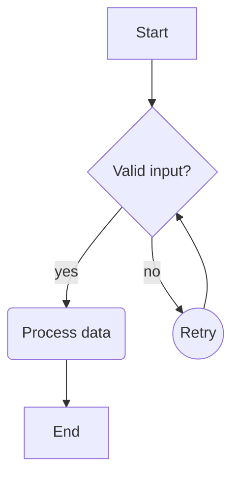
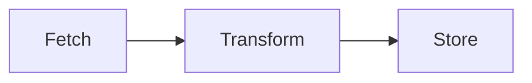
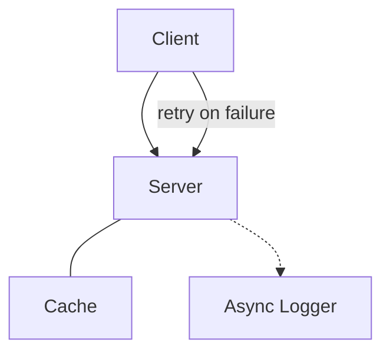
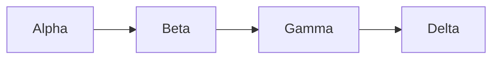
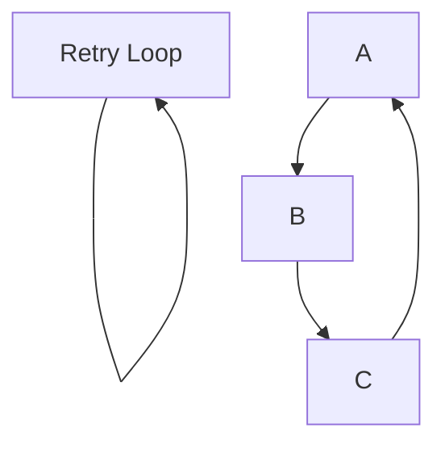
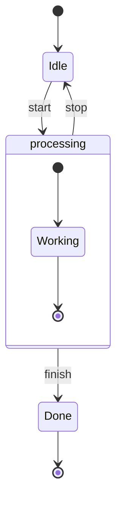
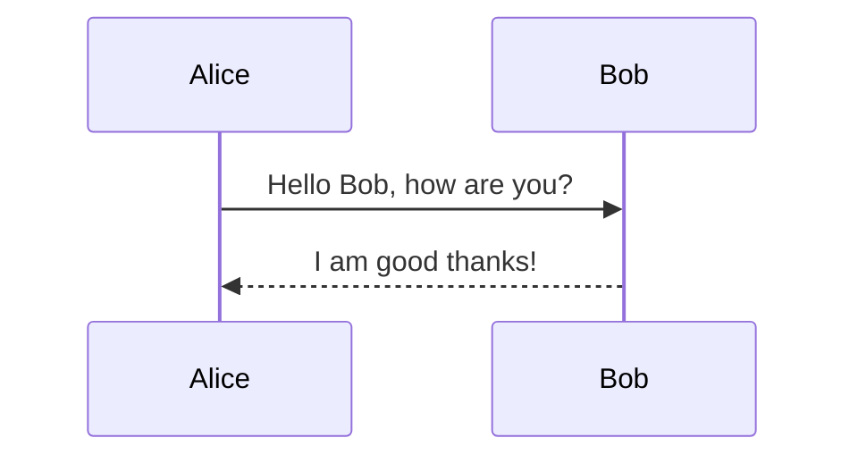
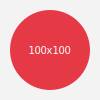
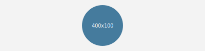
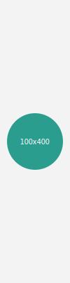

# Diagram feature examples

Example cases exercising the Mermaid rendering (`desk/mermaid.py`) and
SVG rendering (`widgets/svg_viewer/`) built for TODO `a76e723` and
`c7d6e4d`. Open this file in the **Markdown** widget (formerly "Markdown
(Extended)", renamed TODO 858752b) to see everything render; the
embedded SVGs can also be opened individually in the **SVG Viewer**
widget.

Mermaid support here is intentionally partial — flowchart (basic
shapes only) and flat state diagrams — not a full Mermaid
implementation. See `plans/markdown-ex-widget.md` and
`src/desk/mermaid.py`'s own docstring for the exact supported grammar.

## Mermaid — Flowchart

### All four supported node shapes

Rect (`[Label]`), rounded (`(Label)`), diamond (`{Label}`), and circle
(`((Label))`) — no other shapes (stadium, subroutine, cylinder,
hexagon, ...) are supported.

### Directions (TD / TB / LR / BT / RL)

The same small chain, laid out left-to-right instead of top-down.

### Edge styles

Solid arrow (`-->`), open link/no arrowhead (`---`), dotted arrow
(`-.->`), and a piped edge label (`-->|label|`).

### Multi-node chains on one line

### Self-loops and cycles

The layout's rank assignment is cycle-safe: a self-loop draws as a
small bulging arc instead of a zero-length line, and a cycle among
three nodes still produces a readable (if not crossing-minimized)
layout instead of hanging.

### Known limitations (not shown above)

- No extended flowchart shapes (stadium, subroutine, cylinder,
  hexagon, ...) — only rect/rounded/diamond/circle.
- No inline `-- label -->` edge-label form — only `-->|label|`
  immediately after the operator.
- `subgraph`/`classdef`/`style`/`click`/`linkstyle` lines are ignored
  (skipped, not rendered as grouping boxes or styling), though nodes
  and edges inside a `subgraph` block still parse normally as plain
  nodes.
- No automatic crossing-minimization within a rank (first-seen order
  only).

## Mermaid — State diagram

Start/end pseudostates (`[*]`), labeled transitions, a state
description line, and a composite (nested) state block that's
deliberately skipped — `Active` still renders (as a normal node, using
its description as the label), but `Active`'s nested `Working`/`[*]`
contents do not appear anywhere in the diagram.

## Mermaid — Unsupported diagram: graceful fallback

Any diagram type other than flowchart/state (sequence, class, ER,
gantt, pie, ...), or source that doesn't parse, falls back to showing
the raw fenced text as plain code instead of erroring or crashing the
widget. This is a real `sequenceDiagram` — unsupported here on purpose:

## SVG — embedded images

`` images (including `.svg`) render via `QTextBrowser`'s
own native/indirect handling — see `qtextbrowser-images-svg-controls.md`.

A square SVG:

A wide SVG:

A tall SVG:

## SVG — the SVG Viewer widget (aspect-ratio preservation)

Open any of the three files in `diagram-assets/` directly in the **SVG
Viewer** widget (not embedded in a Markdown file) to see the feature
that widget was built to fix: each file draws the *same* circle
(sized to fill most of its own square/wide/tall viewBox), and the
widget always renders it as a true circle, letterboxed to fit the
widget's own window shape — not stretched into an ellipse the way the
stock `QSvgWidget` does by default. Resize the widget after opening one
of the wide/tall files to see the letterboxing adjust live.
